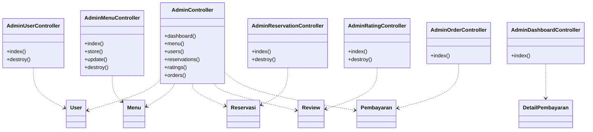
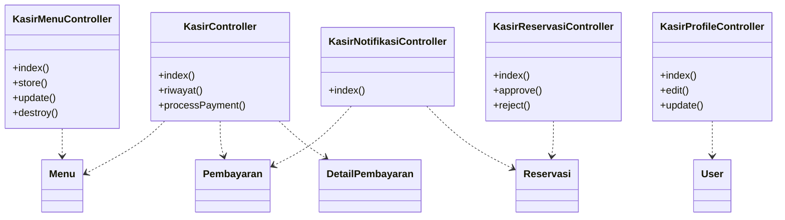
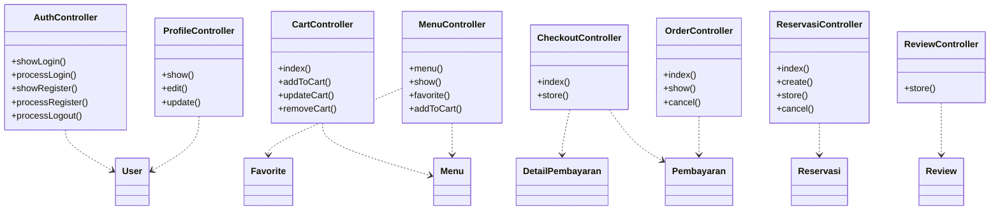
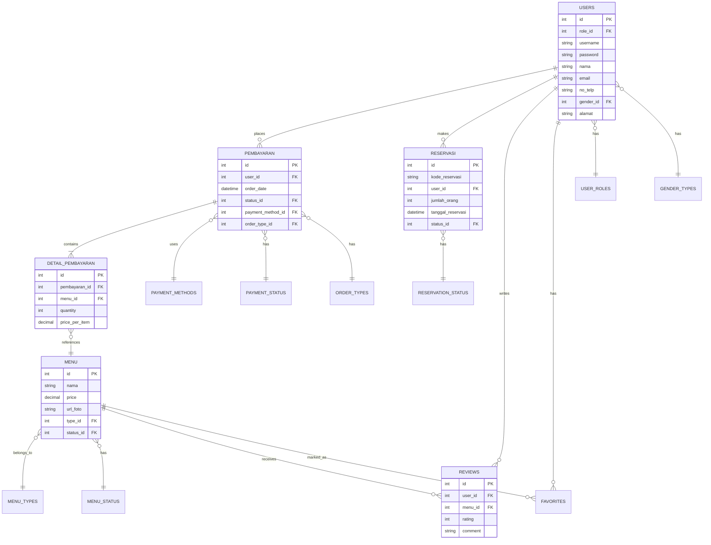
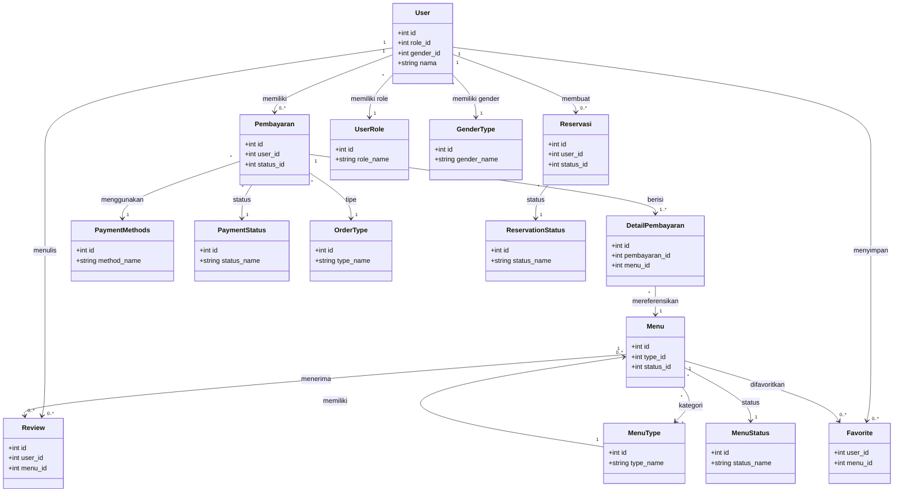

# Class Diagram - Aplikasi Tapal Kuda (PABW)

Dokumentasi class diagram lengkap untuk seluruh modul aplikasi restoran Tapal Kuda.

---

## Diagram Lengkap

```mermaid
classDiagram
    direction TB
    
    %% =============================================
    %% CONTROLLERS - Admin Module
    %% =============================================
    class AdminController {
        +dashboard() View
        +menu() View
        +users() View
        +reservations() View
        +ratings() View
        +orders() View
        +storeMenu(Request) Redirect
        +updateMenu(Request, id) Redirect
        +destroyMenu(id) Response
        +destroyUser(id) Response
        +destroyReservation(id) Response
        +destroyRating(id) Response
    }
    
    class AdminDashboardController {
        +index() View
    }
    
    class AdminMenuController {
        +index() View
        +store(Request) Redirect
        +update(Request, id) Redirect
        +destroy(id) Response
    }
    
    class AdminOrderController {
        +index() View
    }
    
    class AdminRatingController {
        +index() View
        +destroy(id) Response
    }
    
    class AdminReservationController {
        +index() View
        +destroy(id) Response
    }
    
    class AdminUserController {
        +index() View
        +destroy(id) Response
    }
    
    %% =============================================
    %% CONTROLLERS - Kasir Module
    %% =============================================
    class KasirController {
        +index() View
        +riwayat() View
        +processPayment(Request) JsonResponse
    }
    
    class KasirReservasiController {
        +index() View
        +approve(id) Redirect
        +reject(Request, id) Redirect
    }
    
    class KasirMenuController {
        +index() View
        +store(Request) Redirect
        +update(Request, id) Redirect
        +destroy(id) Response
    }
    
    class KasirNotifikasiController {
        +index() View
        -getRelativeTime(datetime) string
    }
    
    class KasirProfileController {
        +index() View
        +edit() View
        +update(Request) Redirect
    }
    
    %% =============================================
    %% CONTROLLERS - Customer Module
    %% =============================================
    class AuthController {
        +showRegister() View
        +processRegister(Request) Redirect
        +showLogin() View
        +processLogin(Request) Redirect
        +processLogout(Request) Redirect
    }
    
    class CartController {
        +index() View
        +addToCart(id) Redirect
        +updateCart(Request) Redirect
        +removeCart(Request) Redirect
        +updateNote(Request) Redirect
    }
    
    class CheckoutController {
        +index() View
        +store(Request) Redirect
    }
    
    class MenuController {
        +menu(Request) View
        +favorite(id) Redirect
        +show(id) View
        +addToCart(id) Redirect
    }
    
    class OrderController {
        +index() View
        +show(id) View
        +cancel(Request, id) Redirect
    }
    
    class ProfileController {
        +show(id) View
        +edit(id) View
        +update(Request, id) Redirect
    }
    
    class ReservasiController {
        +index() View
        +create() View
        +store(Request) Redirect
        +cancel(id) Redirect
    }
    
    class ReviewController {
        +store(Request, id) Redirect
    }
    
    %% =============================================
    %% MODELS - Core Entities
    %% =============================================
    class User {
        -int id
        -int role_id
        -string username
        -string password
        -string nama
        -string email
        -string no_telp
        -int gender_id
        -string alamat
        -string profile_picture
        +role() BelongsTo~UserRole~
        +gender() BelongsTo~GenderType~
        +reservasi() HasMany~Reservasi~
        +pembayaran() HasMany~Pembayaran~
    }
    
    class Pembayaran {
        -int id
        -int user_id
        -datetime order_date
        -int status_id
        -int payment_method_id
        -int order_type_id
        +user() BelongsTo~User~
        +payment_method() BelongsTo~PaymentMethods~
        +status() BelongsTo~PaymentStatus~
        +order_type() BelongsTo~OrderType~
        +details() HasMany~DetailPembayaran~
    }
    
    class DetailPembayaran {
        -int id
        -int pembayaran_id
        -int menu_id
        -int quantity
        -decimal price_per_item
        -string item_notes
        +pembayaran() BelongsTo~Pembayaran~
        +menu() BelongsTo~Menu~
    }
    
    class Menu {
        -int id
        -string nama
        -decimal price
        -string url_foto
        -string deskripsi
        -int type_id
        -int status_id
        +type() BelongsTo~MenuType~
        +status() BelongsTo~MenuStatus~
        +reviews() HasMany~Review~
        +getAverageRatingAttribute() float
    }
    
    class Reservasi {
        -int id
        -string kode_reservasi
        -int user_id
        -int jumlah_orang
        -datetime tanggal_reservasi
        -string message
        -int status_id
        +user() BelongsTo~User~
        +status() BelongsTo~ReservationStatus~
    }
    
    class Review {
        -int id
        -int user_id
        -int menu_id
        -int rating
        -string comment
        +user() BelongsTo~User~
        +menu_item() BelongsTo~Menu~
    }
    
    class Favorite {
        -int user_id
        -int menu_id
    }
    
    %% =============================================
    %% MODELS - Reference/Lookup Tables
    %% =============================================
    class UserRole {
        -int id
        -string role_name
    }
    
    class GenderType {
        -int id
        -string gender_name
    }
    
    class PaymentMethods {
        -int id
        -string method_name
    }
    
    class PaymentStatus {
        -int id
        -string status_name
    }
    
    class OrderType {
        -int id
        -string type_name
    }
    
    class MenuType {
        -int id
        -string type_name
        +menus() HasMany~Menu~
    }
    
    class MenuStatus {
        -int id
        -string status_name
    }
    
    class ReservationStatus {
        -int id
        -string status_name
    }
    
    %% =============================================
    %% RELATIONSHIPS - Controllers to Models
    %% =============================================
    
    %% Admin Controllers
    AdminController ..> User : uses
    AdminController ..> Menu : uses
    AdminController ..> Reservasi : uses
    AdminController ..> Review : uses
    AdminController ..> Pembayaran : uses
    AdminController ..> DetailPembayaran : uses
    
    AdminDashboardController ..> Reservasi : uses
    AdminDashboardController ..> DetailPembayaran : uses
    
    AdminMenuController ..> Menu : uses
    AdminOrderController ..> Pembayaran : uses
    AdminRatingController ..> Review : uses
    AdminReservationController ..> Reservasi : uses
    AdminUserController ..> User : uses
    
    %% Kasir Controllers
    KasirController ..> Menu : uses
    KasirController ..> Pembayaran : uses
    KasirController ..> DetailPembayaran : uses
    
    KasirReservasiController ..> Reservasi : uses
    KasirMenuController ..> Menu : uses
    KasirNotifikasiController ..> Menu : uses
    KasirNotifikasiController ..> Pembayaran : uses
    KasirNotifikasiController ..> Reservasi : uses
    KasirProfileController ..> User : uses
    KasirProfileController ..> Pembayaran : uses
    
    %% Customer Controllers
    AuthController ..> User : uses
    AuthController ..> GenderType : uses
    CartController ..> Menu : uses
    CheckoutController ..> Pembayaran : creates
    CheckoutController ..> DetailPembayaran : creates
    MenuController ..> Menu : uses
    MenuController ..> Favorite : uses
    OrderController ..> Pembayaran : uses
    ProfileController ..> User : uses
    ProfileController ..> GenderType : uses
    ReservasiController ..> Reservasi : uses
    ReviewController ..> Review : creates
    ReviewController ..> Menu : uses
    
    %% =============================================
    %% RELATIONSHIPS - Between Models
    %% =============================================
    
    %% User relationships
    User "1" --> "*" Pembayaran : has
    User "1" --> "*" Reservasi : has
    User "1" --> "*" Review : writes
    User "1" --> "*" Favorite : has
    User "*" --> "1" UserRole : belongs to
    User "*" --> "1" GenderType : has
    
    %% Pembayaran relationships
    Pembayaran "1" --> "*" DetailPembayaran : contains
    Pembayaran "*" --> "1" PaymentMethods : uses
    Pembayaran "*" --> "1" PaymentStatus : has
    Pembayaran "*" --> "1" OrderType : has
    
    %% DetailPembayaran relationships
    DetailPembayaran "*" --> "1" Menu : references
    
    %% Menu relationships
    Menu "*" --> "1" MenuType : belongs to
    Menu "*" --> "1" MenuStatus : has
    Menu "1" --> "*" Review : has
    
    %% Reservasi relationships
    Reservasi "*" --> "1" ReservationStatus : has
    
    %% Favorite relationships
    Favorite "*" --> "1" Menu : references
```

---

## Ringkasan Modul

### 1. Modul Admin (7 Controllers)

| Controller | Fungsi |
|------------|--------|
| `AdminController` | Dashboard & CRUD utama |
| `AdminDashboardController` | Statistik dashboard |
| `AdminMenuController` | Kelola menu |
| `AdminOrderController` | Lihat pesanan |
| `AdminRatingController` | Kelola rating/ulasan |
| `AdminReservationController` | Kelola reservasi |
| `AdminUserController` | Kelola pengguna |

### 2. Modul Kasir (5 Controllers)

| Controller | Fungsi |
|------------|--------|
| `KasirController` | Transaksi & POS |
| `KasirReservasiController` | Approve/reject reservasi |
| `KasirMenuController` | Kelola menu |
| `KasirNotifikasiController` | Notifikasi real-time |
| `KasirProfileController` | Profil kasir |

### 3. Modul Customer (8 Controllers)

| Controller | Fungsi |
|------------|--------|
| `AuthController` | Login & Register |
| `CartController` | Keranjang belanja |
| `CheckoutController` | Proses checkout |
| `MenuController` | Lihat & cari menu |
| `OrderController` | Riwayat pesanan |
| `ProfileController` | Profil pelanggan |
| `ReservasiController` | Buat reservasi |
| `ReviewController` | Ulasan menu |

---

## Model Entities (16 Models)

### Core Models
| Model | Tabel | Deskripsi |
|-------|-------|-----------|
| `User` | users | Data pengguna |
| `Pembayaran` | pembayaran | Transaksi pembayaran |
| `DetailPembayaran` | detail_pembayaran | Detail item pesanan |
| `Menu` | menu | Daftar menu |
| `Reservasi` | reservasi | Data reservasi |
| `Review` | reviews | Ulasan pengguna |
| `Favorite` | favorites | Menu favorit |

### Reference Models
| Model | Tabel | Deskripsi |
|-------|-------|-----------|
| `UserRole` | user_roles | Role pengguna (admin, kasir, customer) |
| `GenderType` | gender_types | Jenis kelamin |
| `PaymentMethods` | payment_methods | Metode bayar |
| `PaymentStatus` | payment_status | Status pembayaran |
| `OrderType` | order_types | Tipe pesanan |
| `MenuType` | menu_types | Kategori menu |
| `MenuStatus` | menu_status | Status menu |
| `ReservationStatus` | reservation_status | Status reservasi |

---

## Diagram Per Modul

### Modul Admin

### Modul Kasir

### Modul Customer

### Entity Relationship Diagram (ERD)

---

## Jenis Multiplicity (Cardinality)

### Notasi Multiplicity

| Simbol | Nama | Arti |
|--------|------|------|
| `1` | One | Tepat satu |
| `0..1` | Zero or One | Nol atau satu (opsional) |
| `*` atau `0..*` | Zero or Many | Nol atau lebih |
| `1..*` | One or Many | Satu atau lebih (minimal 1) |
| `n` | Specific Number | Tepat n |
| `n..m` | Range | Antara n sampai m |

### Tabel Relasi dengan Multiplicity

#### One-to-Many (1 : N) - Satu ke Banyak

| Parent (1) | Child (N) | Foreign Key | Deskripsi |
|------------|-----------|-------------|-----------|
| `User` | `Pembayaran` | `user_id` | 1 User memiliki 0 atau lebih Pembayaran |
| `User` | `Reservasi` | `user_id` | 1 User membuat 0 atau lebih Reservasi |
| `User` | `Review` | `user_id` | 1 User menulis 0 atau lebih Review |
| `User` | `Favorite` | `user_id` | 1 User menyimpan 0 atau lebih Favorite |
| `Pembayaran` | `DetailPembayaran` | `pembayaran_id` | 1 Pembayaran memiliki 1 atau lebih Detail |
| `Menu` | `Review` | `menu_id` | 1 Menu menerima 0 atau lebih Review |
| `Menu` | `DetailPembayaran` | `menu_id` | 1 Menu ada di 0 atau lebih Detail |
| `Menu` | `Favorite` | `menu_id` | 1 Menu difavoritkan 0 atau lebih kali |
| `MenuType` | `Menu` | `type_id` | 1 Kategori memiliki 0 atau lebih Menu |
| `UserRole` | `User` | `role_id` | 1 Role dimiliki 0 atau lebih User |

#### Many-to-One (N : 1) - Banyak ke Satu

| Child (N) | Parent (1) | Foreign Key | Deskripsi |
|-----------|------------|-------------|-----------|
| `User` | `UserRole` | `role_id` | Banyak User memiliki 1 Role |
| `User` | `GenderType` | `gender_id` | Banyak User memiliki 1 Gender |
| `Pembayaran` | `User` | `user_id` | Banyak Pembayaran milik 1 User |
| `Pembayaran` | `PaymentMethods` | `payment_method_id` | Banyak Pembayaran pakai 1 Metode |
| `Pembayaran` | `PaymentStatus` | `status_id` | Banyak Pembayaran punya 1 Status |
| `Pembayaran` | `OrderType` | `order_type_id` | Banyak Pembayaran punya 1 Tipe |
| `DetailPembayaran` | `Pembayaran` | `pembayaran_id` | Banyak Detail milik 1 Pembayaran |
| `DetailPembayaran` | `Menu` | `menu_id` | Banyak Detail referensi 1 Menu |
| `Menu` | `MenuType` | `type_id` | Banyak Menu punya 1 Kategori |
| `Menu` | `MenuStatus` | `status_id` | Banyak Menu punya 1 Status |
| `Reservasi` | `User` | `user_id` | Banyak Reservasi milik 1 User |
| `Reservasi` | `ReservationStatus` | `status_id` | Banyak Reservasi punya 1 Status |
| `Review` | `User` | `user_id` | Banyak Review ditulis 1 User |
| `Review` | `Menu` | `menu_id` | Banyak Review untuk 1 Menu |

#### Many-to-Many (M : N) - Banyak ke Banyak

| Class A | Class B | Junction Table | Deskripsi |
|---------|---------|----------------|-----------|
| `User` | `Menu` | `favorites` | User bisa favorite banyak Menu, Menu bisa difavorite banyak User |

### Diagram Relasi dengan Multiplicity

### Cara Membaca Multiplicity

**Contoh:**
- `User "1" --> "0..*" Pembayaran` 
  - Dibaca: "Satu User dapat memiliki **nol atau lebih** Pembayaran"
  
- `Pembayaran "1" --> "1..*" DetailPembayaran`
  - Dibaca: "Satu Pembayaran **harus memiliki minimal satu** DetailPembayaran"
  
- `Menu "*" --> "1" MenuType`
  - Dibaca: "**Banyak** Menu dimiliki oleh **tepat satu** MenuType"
  
- `User "*" --> "1" UserRole`
  - Dibaca: "**Banyak** User memiliki **tepat satu** UserRole"

