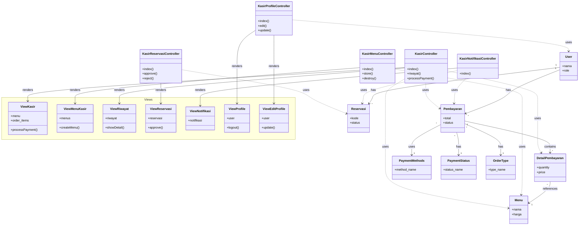

# Class Diagram - Modul Kasir

Class diagram ini menunjukkan struktur class dan relasi antar entitas pada modul **Kasir** aplikasi Tapal Kuda.

---

## Tabel Class Diagram (Format UML Box)

### Controllers

#### KasirController

| **KasirController** |
|---------------------|
| + ModelMenu : menu |
| + ModelPembayaran : pembayaran |
| + ModelDetailPembayaran : detail_pembayaran |
|---------------------|
| + index () : View |
| + riwayat () : View |
| + processPayment ($request) : JsonResponse |

#### KasirReservasiController

| **KasirReservasiController** |
|------------------------------|
| + ModelReservasi : reservasi |
|------------------------------|
| + index () : View |
| + approve ($id) : Redirect |
| + reject ($request, $id) : Redirect |

#### KasirMenuController

| **KasirMenuController** |
|-------------------------|
| + ModelMenu : menu |
|-------------------------|
| + index () : View |
| + store ($request) : Redirect |
| + update ($request, $id) : Redirect |
| + destroy ($id) : Response |

#### KasirNotifikasiController

| **KasirNotifikasiController** |
|-------------------------------|
| + ModelMenu : menu |
| + ModelPembayaran : pembayaran |
| + ModelReservasi : reservasi |
|-------------------------------|
| + index () : View |
| - getRelativeTime ($datetime) : string |

#### KasirProfileController

| **KasirProfileController** |
|----------------------------|
| + ModelUser : users |
| + ModelPembayaran : pembayaran |
|----------------------------|
| + index () : View |
| + edit () : View |
| + update ($request) : Redirect |

---

### Views (Blade Templates)

#### ViewKasir (kasir.blade.php)

| **ViewKasir** |
|---------------|
| + menu : array |
| + order_items : array |
|---------------|
| + renderCart() : void |
| + updateTotals() : void |
| + addToCart(itemId) : void |
| + processPayment() : void |
| + printReceipt() : void |

#### ViewMenuKasir (menu.blade.php)

| **ViewMenuKasir** |
|-------------------|
| + menus : Collection |
|-------------------|
| + createMenu() : void |
| + editMenu(id) : void |
| + deleteMenu(id) : void |
| + filterMenu() : void |

#### ViewRiwayat (riwayat.blade.php)

| **ViewRiwayat** |
|-----------------|
| + riwayat : Collection |
| + detailStruk : array |
|-----------------|
| + renderTable() : void |
| + showDetail(kode) : void |

#### ViewReservasi (reservasi.blade.php)

| **ViewReservasi** |
|-------------------|
| + reservasi : Collection |
|-------------------|
| + approveReservasi(id) : void |
| + rejectReservasi(id) : void |

#### ViewNotifikasi (notif.blade.php)

| **ViewNotifikasi** |
|--------------------|
| + notifikasi : Collection |
|--------------------|
| + displayList() : void |

#### ViewProfile (profile.blade.php)

| **ViewProfile** |
|-----------------|
| + user : User |
|-----------------|
| + showStats() : void |
| + logout() : void |

#### ViewEditProfile (edit-profile.blade.php)

| **ViewEditProfile** |
|---------------------|
| + user : User |
|---------------------|
| + updateProfile() : void |
| + previewAvatar() : void |

---

### Models

#### User

| **User** |
|----------|
| - id : int |
| - role_id : int |
| - username : string |
| - password : string |
| - nama : string |
| - email : string |
| - no_telp : string |
| - gender_id : int |
| - alamat : string |
| - profile_picture : string |
|----------|
| + role () : BelongsTo |
| + gender () : BelongsTo |
| + reservasi () : HasMany |
| + pembayaran () : HasMany |

#### Pembayaran

| **Pembayaran** |
|----------------|
| - id : int |
| - user_id : int |
| - order_date : datetime |
| - status_id : int |
| - payment_method_id : int |
| - order_type_id : int |
|----------------|
| + user () : BelongsTo |
| + payment_method () : BelongsTo |
| + status () : BelongsTo |
| + order_type () : BelongsTo |
| + details () : HasMany |

#### DetailPembayaran

| **DetailPembayaran** |
|----------------------|
| - id : int |
| - pembayaran_id : int |
| - menu_id : int |
| - quantity : int |
| - price_per_item : decimal |
| - item_notes : string |
|----------------------|
| + pembayaran () : BelongsTo |
| + menu () : BelongsTo |

#### Menu

| **Menu** |
|----------|
| - id : int |
| - nama : string |
| - price : decimal |
| - url_foto : string |
| - deskripsi : string |
| - type_id : int |
| - status_id : int |
|----------|
| + type () : BelongsTo |
| + status () : BelongsTo |
| + reviews () : HasMany |
| + getAverageRatingAttribute () : float |

#### Reservasi

| **Reservasi** |
|---------------|
| - id : int |
| - kode_reservasi : string |
| - user_id : int |
| - jumlah_orang : int |
| - tanggal_reservasi : datetime |
| - message : string |
| - status_id : int |
|---------------|
| + user () : BelongsTo |
| + status () : BelongsTo |

---

### Reference Tables

#### PaymentMethods

| **PaymentMethods** |
|--------------------|
| - id : int |
| - method_name : string |
|--------------------|
| Values: Cash (1), E-Wallet (2), QRIS (3) |

#### PaymentStatus

| **PaymentStatus** |
|-------------------|
| - id : int |
| - status_name : string |
|-------------------|
| Values: Completed (1), Pending (2), Cancelled (3) |

#### OrderType

| **OrderType** |
|---------------|
| - id : int |
| - type_name : string |
|---------------|
| Values: Dine In (1), Take Away (2) |

#### MenuType

| **MenuType** |
|--------------|
| - id : int |
| - type_name : string |
|--------------|
| + menus () : HasMany |

#### MenuStatus

| **MenuStatus** |
|----------------|
| - id : int |
| - status_name : string |
|----------------|
| Values: Tersedia (1), Habis (2) |

#### ReservationStatus

| **ReservationStatus** |
|-----------------------|
| - id : int |
| - status_name : string |
|-----------------------|
| Values: Pending (1), Confirmed (2), Cancelled (3) |

---

## Diagram

