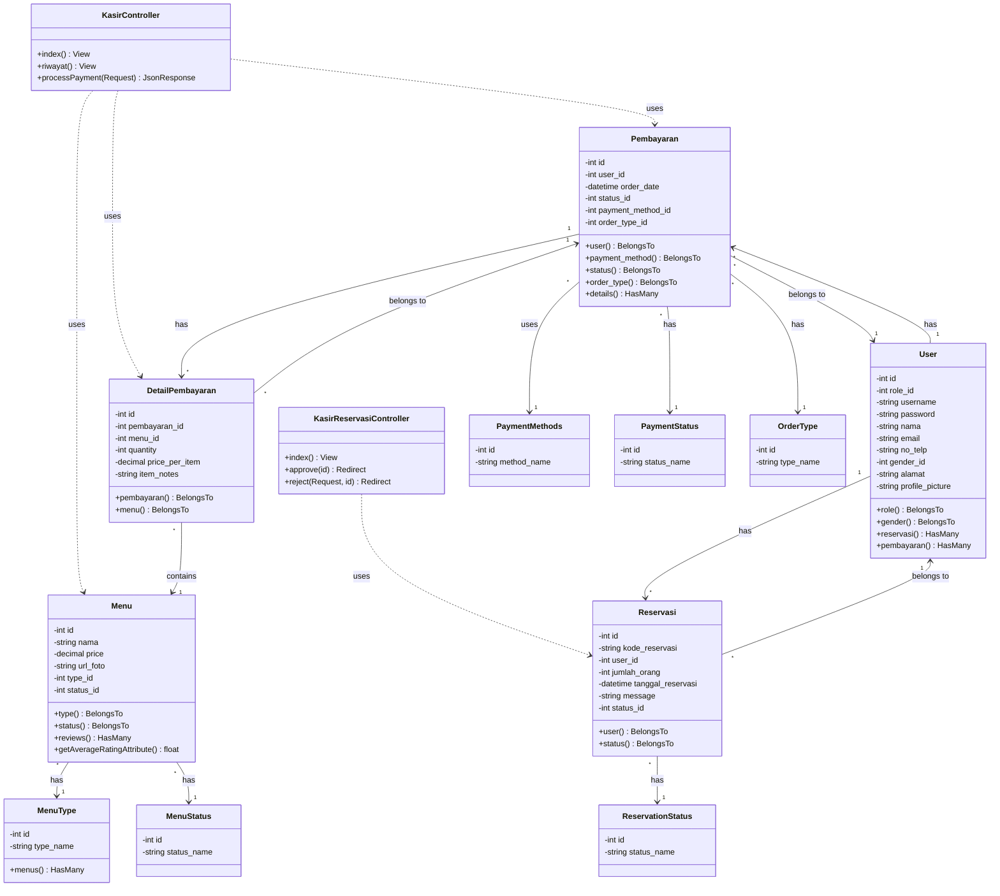

# Class Diagram - Modul Kasir

Class diagram ini menunjukkan struktur class dan relasi antar entitas pada modul **Kasir** aplikasi Tapal Kuda.

## Diagram

## Penjelasan Komponen

### Controllers

| Controller | Deskripsi |
|------------|-----------|
| **KasirController** | Mengelola halaman kasir utama, riwayat pesanan, dan proses pembayaran |
| **KasirReservasiController** | Mengelola reservasi pelanggan (approve/reject) |

### Models Utama

| Model | Deskripsi |
|-------|-----------|
| **User** | Data pengguna (kasir/pelanggan) |
| **Pembayaran** | Transaksi pembayaran |
| **DetailPembayaran** | Detail item dalam pembayaran |
| **Menu** | Daftar menu yang tersedia |
| **Reservasi** | Data reservasi pelanggan |

### Models Referensi

| Model | Deskripsi |
|-------|-----------|
| **PaymentMethods** | Metode pembayaran (Cash, E-Wallet, QRIS) |
| **PaymentStatus** | Status pembayaran (Pending, Completed, Cancelled) |
| **OrderType** | Tipe pesanan (Dine In, Take Away) |
| **MenuType** | Kategori menu |
| **MenuStatus** | Status menu (Tersedia, Tidak Tersedia) |
| **ReservationStatus** | Status reservasi |

## Alur Kerja Kasir

1. **Proses Pembayaran**: `KasirController.processPayment()` → Membuat `Pembayaran` → Membuat `DetailPembayaran` untuk setiap item
2. **Lihat Riwayat**: `KasirController.riwayat()` → Query `Pembayaran` dengan relasi
3. **Manajemen Reservasi**: `KasirReservasiController` → Update status `Reservasi`
