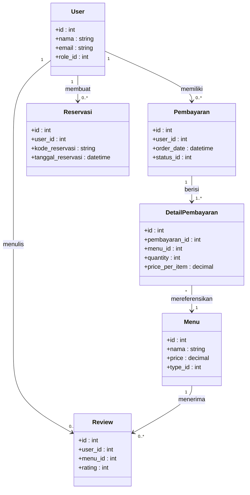
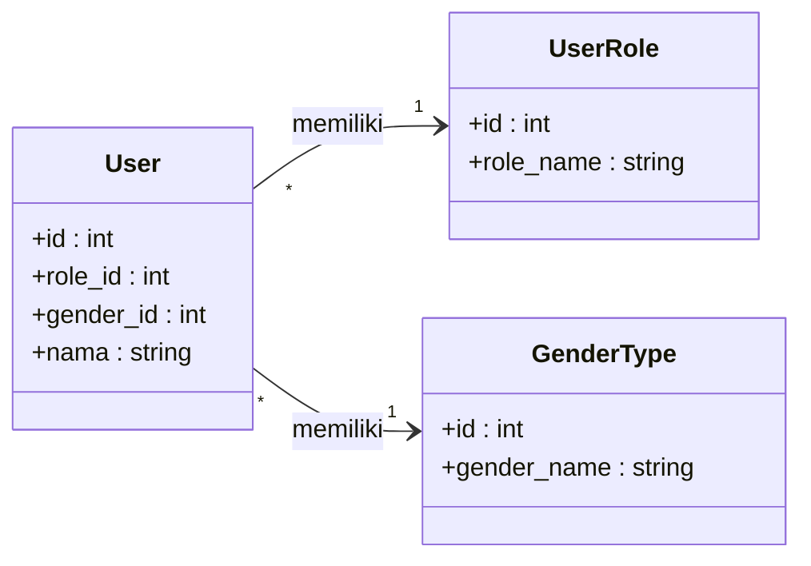
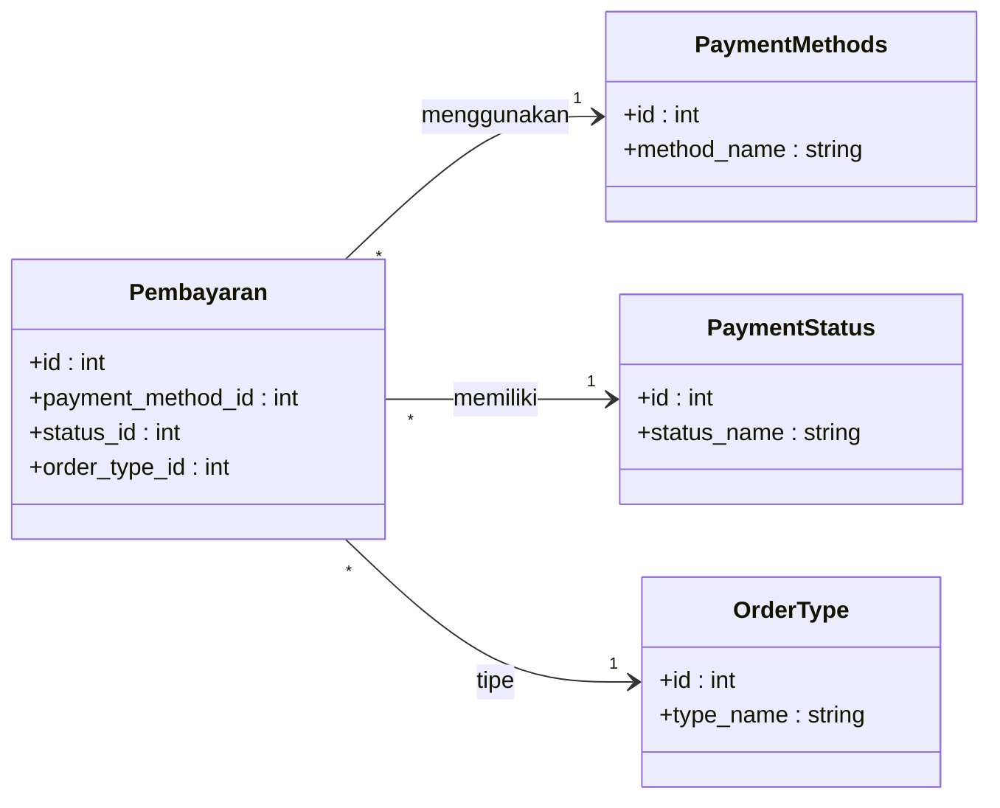
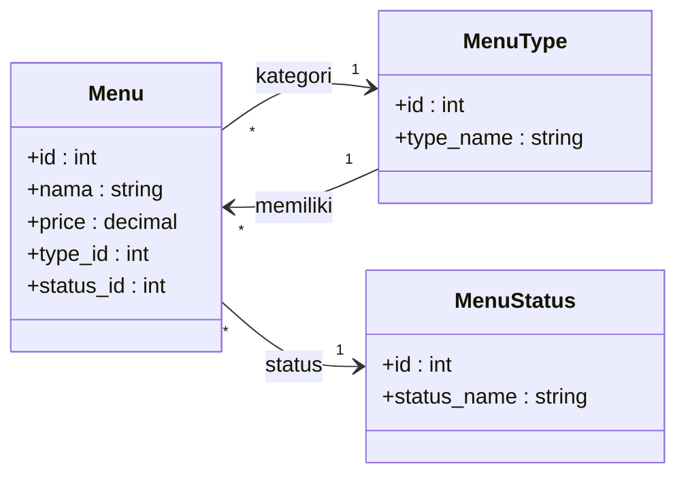
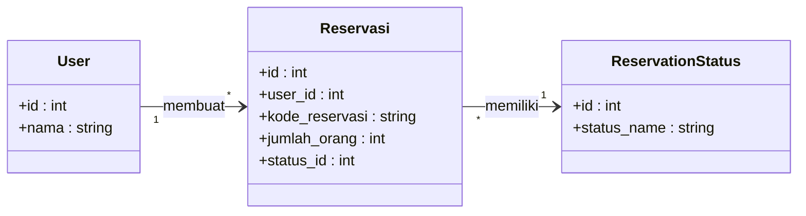
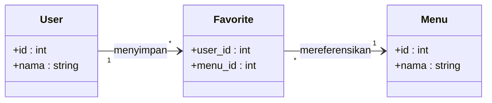

# Class Diagram - Relasi Antar Model (Simplified)

Diagram relasi sederhana yang fokus pada model-model utama aplikasi Tapal Kuda.

---

## 1. Diagram Inti - User & Transaksi

---

## 2. Diagram User & Reference Tables

**Role Values:** Admin (1), Kasir (2), Customer (3)

---

## 3. Diagram Pembayaran & Status

**Payment Methods:** Cash (1), E-Wallet (2), QRIS (3)
**Order Types:** Dine In (1), Take Away (2)

---

## 4. Diagram Menu & Kategori

**Menu Status:** Tersedia (1), Habis (2)

---

## 5. Diagram Reservasi

**Reservation Status:** Pending (1), Confirmed (2), Cancelled (3)

---

## 6. Diagram Favorite (Many-to-Many)

---

## Ringkasan Relasi

| Dari | Ke | Tipe | Keterangan |
|------|-----|------|------------|
| User | Pembayaran | 1 : N | 1 user bisa buat banyak order |
| User | Reservasi | 1 : N | 1 user bisa buat banyak reservasi |
| User | Review | 1 : N | 1 user bisa buat banyak review |
| User | Favorite | 1 : N | 1 user bisa punya banyak favorite |
| Pembayaran | DetailPembayaran | 1 : N | 1 order punya banyak item |
| Menu | Review | 1 : N | 1 menu bisa punya banyak review |
| Menu | DetailPembayaran | 1 : N | 1 menu bisa ada di banyak order |
| User | UserRole | N : 1 | Banyak user punya 1 role |
| Pembayaran | PaymentStatus | N : 1 | Banyak order punya 1 status |
| Menu | MenuType | N : 1 | Banyak menu punya 1 kategori |
| User | Menu | M : N | (via Favorite) |
