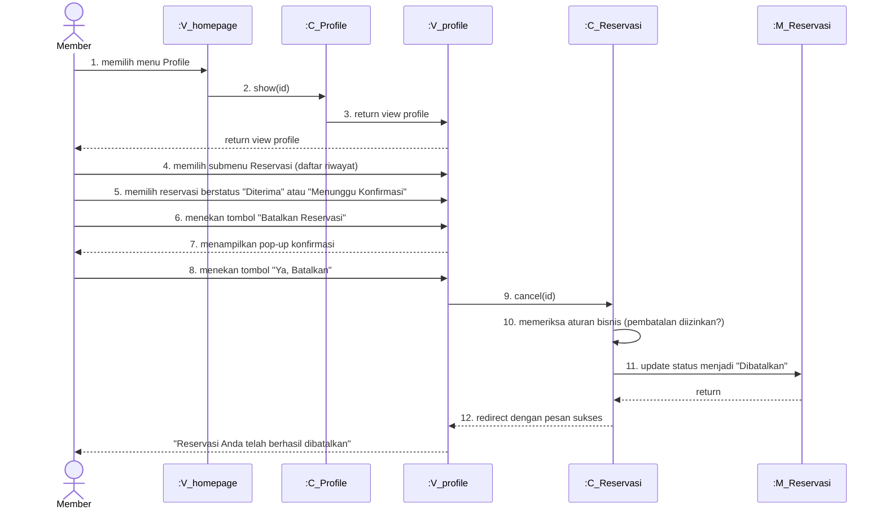

# Sequence Diagram - Membatalkan Reservasi

Sequence diagram ini menunjukkan alur proses **Membatalkan Reservasi** pada aplikasi Tapal Kuda.

---

## Aktor dan Komponen

| Komponen | Notasi | Deskripsi |
|----------|--------|-----------|
| **Member** | Actor | Pengguna yang ingin membatalkan reservasi |
| **:V_homepage** | View | Halaman utama (homepage) |
| **:V_profile** | View | Halaman profile member |
| **:C_Profile** | Controller | ProfileController |
| **:C_Reservasi** | Controller | ReservasiController |
| **:M_Reservasi** | Model | Model Reservasi |

---

## Sequence Diagram



---

## Deskripsi Alur

### Aktor (Member)
1. **Memilih reservasi** - Memilih salah satu reservasi berstatus "Diterima" atau "Menunggu Konfirmasi" dari daftar riwayat
2. **Menekan tombol "Batalkan Reservasi"** - Klik tombol batalkan
4. **Menekan tombol "Ya, Batalkan"** - Konfirmasi pembatalan

### Sistem
3. **Menampilkan pop-up konfirmasi** - "Apakah Anda yakin ingin membatalkan reservasi ini?"
5. **cancel(id)** - Controller menerima request pembatalan
6. **Memeriksa aturan bisnis** - Validasi:
   - Reservasi belum dibatalkan sebelumnya (status_id != 3)
   - Tanggal reservasi belum lewat
   - Pembatalan minimal 2 jam sebelum waktu reservasi
7. **Mengubah status reservasi** - Update `status_id = 3` (Dibatalkan)
8. **Menampilkan pesan** - "Reservasi Anda telah berhasil dibatalkan"

---

## Kode Terkait

### Routes (web.php)
```php
Route::post('/reservasi/{id}/cancel', [ReservasiController::class, 'cancel'])->name('reservations.cancel');
```

### ReservasiController::cancel()
```php
public function cancel($id)
{
    // Check authentication
    if (!Auth::check()) {
        return redirect()->route('login')->with('error', 'Silakan login terlebih dahulu.');
    }

    // Get reservation with authorization check
    $reservasi = Reservasi::where('user_id', Auth::id())->findOrFail($id);

    // Check if reservation can be cancelled (status pending/confirmed only)
    if ($reservasi->status_id == 3) {
        return redirect()->back()->with('error', 'Reservasi ini sudah dibatalkan sebelumnya.');
    }

    // Check if reservation date is not in the past
    if (Carbon::parse($reservasi->tanggal_reservasi)->isPast()) {
        return redirect()->back()->with('error', 'Tidak dapat membatalkan reservasi yang sudah lewat.');
    }

    // Update status to cancelled (status_id = 3)
    $reservasi->status_id = 3;
    $reservasi->save();

    return redirect()->back()->with('success', 'Reservasi berhasil dibatalkan.');
}
```
