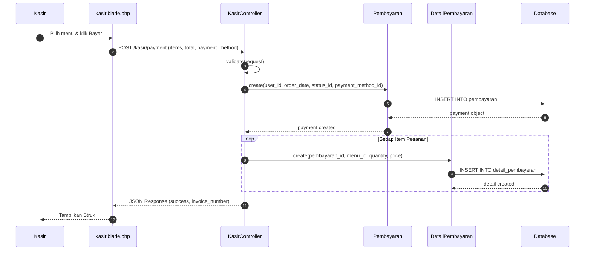
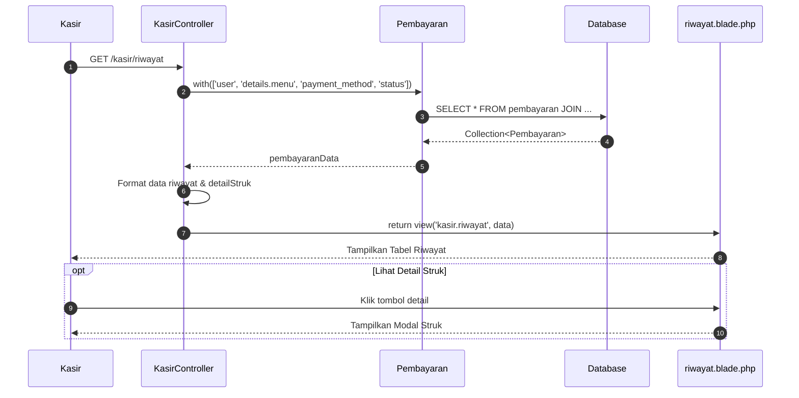
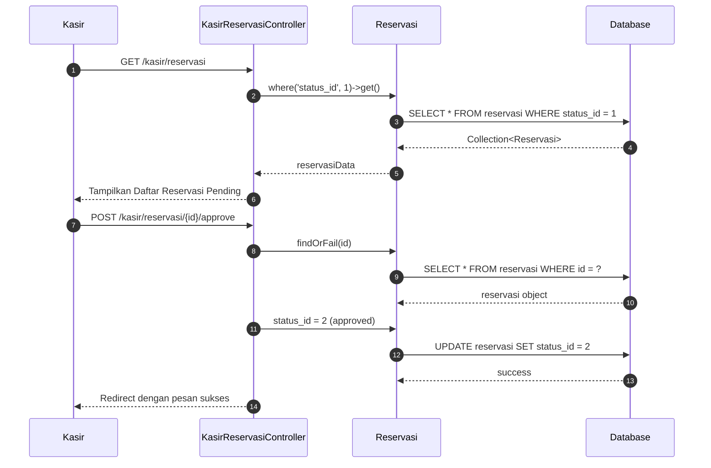
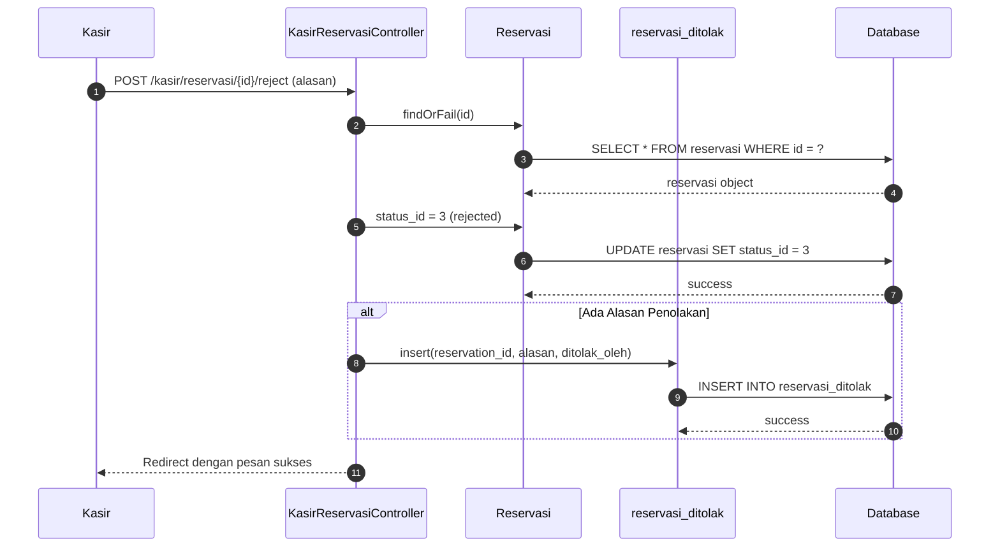
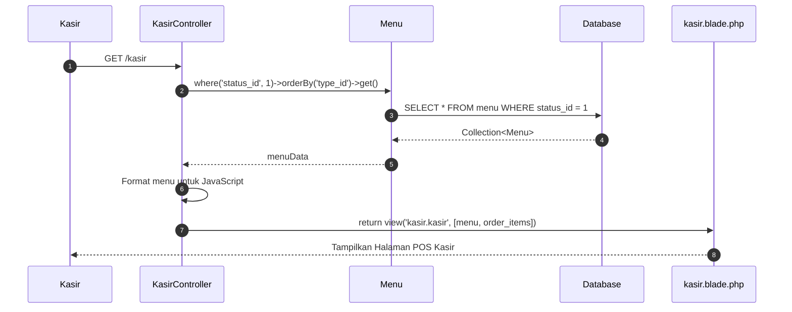

# Sequence Diagram - Modul Kasir

Sequence diagram untuk alur proses pada modul **Kasir** aplikasi Tapal Kuda.

---

## 1. Proses Pembayaran (Process Payment)

---

## 2. Lihat Riwayat Pesanan

---

## 3. Manajemen Reservasi - Approve

---

## 4. Manajemen Reservasi - Reject

---

## 5. Halaman Utama Kasir (Index)

---

## Ringkasan Alur

| Proses | Endpoint | Method | Deskripsi |
|--------|----------|--------|-----------|
| Halaman Kasir | `/kasir` | GET | Menampilkan menu & form pesanan |
| Proses Pembayaran | `/kasir/payment` | POST | Menyimpan transaksi |
| Riwayat | `/kasir/riwayat` | GET | Melihat histori transaksi |
| Reservasi | `/kasir/reservasi` | GET | Daftar reservasi pending |
| Approve | `/kasir/reservasi/{id}/approve` | POST | Konfirmasi reservasi |
| Reject | `/kasir/reservasi/{id}/reject` | POST | Tolak reservasi |
