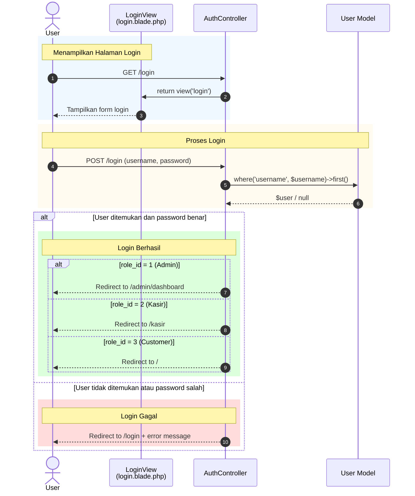

# Sequence Diagram - Login

Sequence diagram ini menunjukkan alur proses **Login** pada aplikasi Tapal Kuda.

---

## Aktor dan Komponen

| Komponen | Deskripsi |
|----------|-----------|
| **User** | Pengguna yang ingin login ke sistem |
| **LoginView** | Halaman login (login.blade.php) |
| **AuthController** | Controller yang menangani autentikasi |
| **User Model** | Model User untuk query database |

---

## Sequence Diagram



---

## Deskripsi Alur

### 1. Menampilkan Halaman Login
1. User mengakses URL `/login`
2. `AuthController::showLogin()` dipanggil
3. Controller mengembalikan view `login.blade.php`

### 2. Proses Submit Login
1. User mengisi username dan password, lalu submit
2. `AuthController::processLogin()` dipanggil
3. Controller mencari user berdasarkan username

### 3. Validasi & Redirect
- **Sukses** → Redirect berdasarkan role (Admin/Kasir/Customer)
- **Gagal** → Redirect ke /login dengan pesan error

---

## Kode Terkait

### Routes (web.php)
```php
Route::get('/login', [AuthController::class, 'showLogin'])->name('login');
Route::post('/login', [AuthController::class, 'processLogin']);
```

### AuthController Methods
```php
public function showLogin()
{
    return view('login');
}

public function processLogin(Request $request)
{
    $user = User::where('username', $request->username)->first();

    if ($user && Hash::check($request->password, $user->password)) {
        Auth::login($user);
        $request->session()->regenerate();

        return match ($user->role_id) {
            1 => redirect()->route('admin.dashboard'),
            2 => redirect()->route('kasir.index'),
            3 => redirect('/'),
            default => redirect('/'),
        };
    }
    return redirect('/login')->with('error', 'Username atau password salah!');
}
```

