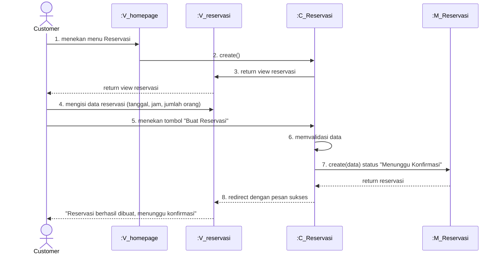

# Sequence Diagram - Membuat Reservasi Meja

Sequence diagram ini menunjukkan alur proses **Membuat Reservasi Meja** pada aplikasi Tapal Kuda.

---

## Aktor dan Komponen

| Komponen | Notasi | Deskripsi |
|----------|--------|-----------|
| **Customer** | Actor | Pengguna yang ingin membuat reservasi |
| **:V_homepage** | View | Halaman utama (homepage) |
| **:V_reservasi** | View | Halaman form reservasi (Reservasi.blade.php) |
| **:C_Reservasi** | Controller | ReservasiController |
| **:M_Reservasi** | Model | Model Reservasi untuk menyimpan data |

---

## Sequence Diagram



---

## Deskripsi Alur

### Aktor (Customer)
1. **Memilih tanggal reservasi** - Input tanggal pada form
2. **Memilih jam reservasi** - Input jam pada form
3. **Memasukkan jumlah orang** - Input jumlah tamu
4. **Menekan tombol "Buat Reservasi"** - Submit form

### Sistem
5. **store(request)** - Controller menerima data dari form
6. **Memvalidasi data** - Validasi:
   - Tanggal tidak boleh di masa lalu (`after_or_equal:today`)
   - Jam harus dalam jam operasional
   - Jumlah orang minimal 1
7. **Menyimpan ke database** - `Reservasi::create()` dengan `status_id = 1` (Pending/Menunggu Konfirmasi)
8. **Menampilkan pesan sukses** - "Reservasi Anda telah berhasil dibuat dan sedang menunggu konfirmasi"

---

## Kode Terkait

### Routes (web.php)
```php
Route::get('/reservasi', [ReservasiController::class, 'create'])->name('reservasi.create');
Route::post('/reservasi', [ReservasiController::class, 'store'])->name('reservasi.store');
```

### ReservasiController::store()
```php
public function store(Request $request)
{
    // 1. Validasi Input
    $request->validate([
        'tanggal_reservasi' => 'required|date|after_or_equal:today',
        'jam_reservasi' => 'required',
        'jumlah_orang' => 'required|integer|min:1',
        'message' => 'nullable|string'
    ]);

    // 2. Generate Kode Unik
    $kode = 'RSV-' . now()->format('Ymd') . '-' . rand(100, 999);

    // 3. Simpan ke Database
    Reservasi::create([
        'user_id' => Auth::id(),
        'kode_reservasi' => $kode,
        'tanggal_reservasi' => $waktuFix,
        'jumlah_orang' => $request->jumlah_orang,
        'message' => $request->message,
        'status_id' => 1, // Menunggu Konfirmasi
    ]);

    return redirect()->route('reservasi.create')
        ->with('success', 'Reservasi berhasil dibuat! Menunggu konfirmasi dari kasir.');
}
```
